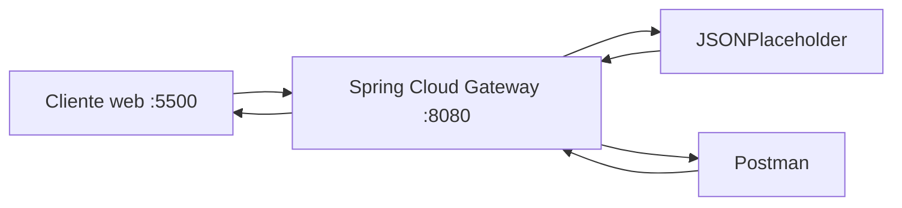

# Evidencias · Laboratorio API Gateway

## Integrantes
- Nombre:Rodrigo Cruz
- Nombre:Maximiliano Diaz
- Nombre:Mario Jaramillo
- Nombre:Felipe Farias

## 1. Backend directo

Antes de utilizar el gateway, registrar las pruebas directas contra JSONPlaceholder.

| Método | URL | Status | Observación |
|---|---|---:|---|
| GET | `https://jsonplaceholder.typicode.com/posts` | 200 | Podemos observar que este metodo en esta pagina nos devuelve una lista entera de variables |
| GET | `https://jsonplaceholder.typicode.com/posts/1` | 200 | Podemos observar que este metodo con el 1 por delante hace que podamos ver el primer objeto de la lista que vimos antes |

**¿Qué información del backend conoce el cliente en este escenario?**

Respuesta:

---

## 2. Arquitectura final



Explicar brevemente qué responsabilidad cumple cada componente.

---

## 3. Pruebas HTTP mediante gateway

| Método | URL | Status | Headers relevantes | Interpretación |
|---|---|---:|---|---|
| GET | `/api/v1/posts` | 200 | access-control-allow-credentials: true x-content-type-options: nosniff | colección |
| GET | `/api/v1/posts/1` | 200 | content-encoding: br  | recurso individual |
| POST | `/api/v1/posts` | 201 | access-control-expose-headers
Location location
https://jsonplaceholder.typicode.com/posts/101 | creación simulada |
| PUT | `/api/v1/posts/1` | 200 | content-encoding: br | actualización simulada |
| DELETE | `/api/v1/posts/1` | 200 | cf-cache-status: DYNAMIC cache-control: no-cache | eliminación simulada |

Para POST y PUT incluir también el body enviado.

---

## 4. Routing

- URL solicitada por el cliente: http://localhost:8080/api/v1/posts/
- `id` de la route: posts-v1
- predicate que hizo match: Path=/api/v1/posts/**
- URI/integration configurada: https://jsonplaceholder.typicode.com
- path recibido finalmente por el backend:  https://jsonplaceholder.typicode.com/api/v1/posts/
- función de `RewritePath`:/api/v1 la funcion del RewritePath hace que elimine esa linea y se quede solamente con la ruta inicial osea /posts

### Recorrido de una petición

Explicar con sus palabras:

```text
cliente → gateway → backend → gateway → cliente
```

---

## 5. Versionado

- Evidencia `/api/v1`:
- Header `X-API-Version` observado:
- Evidencia `/api/v2`:
- Header `X-API-Version` observado:

Responder:

1. ¿Por qué mantener v1 y v2 simultáneamente?
R: Mantener v1 y v2 simultaneamente hace que la v2 este implementada ya y que los clientes que ocupen la pagina vayan migrando a esta nueva pero los antiguos que aun no migren puedan aun asi ocupar la pagina sin que esta se les crashee hasta que sea obligatorio ocupar la v2 y la v1 quede Deprecado
2. ¿Qué consumidores podrían seguir usando v1?
R: Los consumidores que aun no migren o actualicen mejor dicho la pagina o una app hasta que quede deprecado que eso los desarrolladores dan hasta cierto tiempo para que se actualicen
3. ¿Cuándo retirarían una versión?
R: Para retirar una version y sustituirla por otra dan primero un cierto tiempo para que los clientes tengan tiempo de actualizarse y que si no quieren por el momento puedan aun asi ocupar la version antigua 
4. ¿Versionar el contrato público es lo mismo que versionar el servidor desplegado?
R: No es lo mismo debido a que versionar el contrato publico hace que las aplicaciones que consumen tu API esten obsoletas por ejemplo que en la v1 pedias nombre y apellido en 2 campos distintos y en v2 pusiste nombre completo en solo 1 campo. En servidor desplegado  es como mas el codigo fuente , optimizas una consulta SQL o arreglaste un bug cosas que solamente vera el desarrollador y no el que consume tu API, mientras siga recibiendo respuestas tuyas de lo que pide.
---

## 6. Header transversal

- Header esperado: `X-Gateway-Lab: DSY1107`
- Evidencia observada:
- ¿Por qué este comportamiento puede considerarse transversal?: 
R:Se puede considerar transversal debido a que dejas como tu huella digital de quien hizo el codigo o a quien le pertenece. 

---

## 7. CORS

### Antes de configurar CORS

- URL del cliente web: `http://localhost:5500`
- Endpoint consultado: api/v1/posts/1
- Resultado visible: El codigo HTTP 200 y el body en formato json devolviendo el objeto 1 de la lista 
- Mensaje relevante en Console/Network: Los Request aparecen como header como el de URL que sale a que url le estamos consultando  o el metodo que estamos haciendo 

### Después de configurar CORS

- Resultado visible: En la pagina web se puede observar que nos da que hay problema con CORS y eso esta bien ya que nos devuelve 304 osea responde pero no recibimos nada mientras que en Postman nos devuelve bien 200 y con el objeto que buscamos 
- `Access-Control-Allow-Origin`:http://localhost:5500
- `Access-Control-Allow-Methods`:GET,POST,PUT,DELETE,OPTIONS

### Preflight OPTIONS

- Request utilizado: curl -i -X OPTIONS http://localhost:8080/api/v1/posts -H "Origin: http://localhost:5500" -H "Access-Control-Request-Method: POST"
- Status:200 OK
- Headers relevantes: Access-Control-Allow-Origin: http://localhost:5500
Access-Control-Allow-Methods: GET,POST,PUT,DELETE,OPTIONS

Responder:

1. ¿Por qué Postman puede funcionar cuando el navegador falla?
R:Porque Postman es una aplicacion y no una pagina web ya que el CORS se enfoca en eso , en paginas web y Postman inyecta altiro la peticion que hacemos saltandose como esa seguridad que nos da CORS
2. ¿Qué es un preflight?
R:Preflight hace que cuando una pagina web hace una peticion hacia el servidor esta actua antes para verificar si esta pagina web puede hacer esa peticion y si puede se hace la peticion 
3. ¿CORS autentica o autoriza usuarios?
R: CORS autoriza origenes y no usuarios 
4. ¿Qué riesgo tendría permitir cualquier origen sin analizar el contexto?
R:Tendria que esa pagina seria vulnerable a cualquier tipo de ataque proveniente de paginas web o que la informacion que esta tenga este expuesta por eso hay que analizar el contexto y autorizar las paginas web con las que solamente interactuara la nuestra.

---

## 8. Richardson Maturity Model nivel 2

Explicar qué elementos observados en el laboratorio permiten afirmar que la API utiliza recursos, métodos HTTP y status codes con semántica HTTP.

---

## 9. Responsabilidades

| Responsabilidad | Cliente | Gateway | Backend | Justificación |
|---|:---:|:---:|:---:|---|
| routing |  | x |  | Debido a que recibe la peticion y este decide a donde debe enviarla segun la url |
| lógica de negocio |  |  | x | Aqui es donde se procesa la informacion y se ejecuta el proposito del software |
| autenticación/autorización |  | x | x | Son las dos porque el Gateway actua como una primera capa de seguridad en la que este valida si el token es real y si lo es lo pasa al backend para que actue como una segunda capa de seguridad y verificar si es real y que permisos tiene |
| transformación de rutas |  | x |  | Es Gateway ya que ocupa RewritePath para ocultar la estructura interna antes de enviarla al backend |
| persistencia |  |  | x | Es backend debido a que este se conecta a la base de datos para guardar,actualizar o borrar informacion |
| rate limiting |  | x |  | Es Gateway porque este antes de que entre una peticion pone un limite para no sobresaturar al backend  |
| reglas de negocio |  |  | x | Similar a la logica de negocio este tambien se encarga el backend porque se encarga de las restricciones internas del sistema |
| observabilidad |  | x | x | Son las 2 debido a que uno se encarga de monitorear el trafico de peticiones y otra sea encarga de los detalles internos como que cuanto se demoro la base de datos en responder  |

---

## 10. Problemas encontrados

1. Problema:CORS mal configurado 
   - causa:Al habilitar el CORS y configurarlo para que solamente acepte las peticiones que se nos pidio nos daba un error 404 cosa que no deberia y era debido a la estructura del application con los niveles y esto hacia que cuando se hiciera una peticion al backend este no supiera que hacer ya que es como si no tuviera nada configurado de rutas y eso da 404 como en el cliente como tambien en Postman
   - solución:La solucion fue probar otro metodo para implementar el cors no como salia en la guia sino hacerlo en la misma ruta (id) ponerlo en "predicates" y ahi si pasaba el cors y no nos daba error en cliente y Postman si pasaba.

---

## 11. Colaboración GitHub

| Integrante | Rama | Pull Request | Aporte principal |
|---|---|---|---|
| Rodrigo Cruz | Feature/cors y Feature/version-v2 | https://github.com/VoodoooQ/dsy1107-lab-api-gateway-grupo-06/pull/1 | Completar todo el laboratorio |


Agregar enlaces a los Pull Requests.

---

## 12. Conclusiones

- ¿Qué problema resolvió el gateway?
R:El gateway refuerza la seguridad ante las paginas web y poder permitir solamente las paginas confiables o que se ocupen en el contexto para que no se vulnere la informacion sensible que uno tiene proveniente del ataque de una pagina externa.
- ¿Qué concepto del laboratorio sería equivalente al trabajar posteriormente con Amazon API Gateway?
R:Todo lo que hicimos como la configuracion de enrutamiento y politicas transversales se puede aplicar en cualquier tecnologia.
- ¿Qué aprendió el grupo que no depende específicamente de Spring Cloud Gateway?
R:Aprendimos que la seguridad en base a CORS y como los navegadores realizan peticiones previas con Preflight es una regla que no solo existe en Spring Cloud Gateway si no que es aplicada en cualquier navegador o lenguaje.
